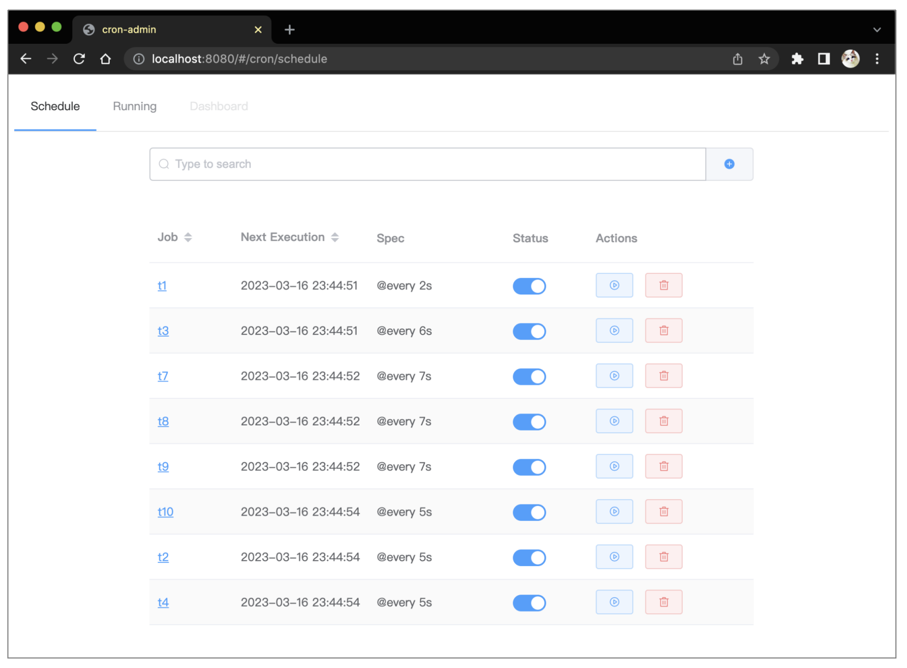

# cron-admin

Web UI tool for administering [cron](https://github.com/yinyajun/cron).  It is based on [vue](https://github.com/vuejs/vue) and uses the UI Toolkit [element-ui](https://github.com/ElemeFE/element).


## Usage

You can import it as a library in your web application.

```go
package main

import (
	"net/http"

	"github.com/yinyajun/cron-admin"
)

func main() {
	http.Handle("/", cron_admin.UIHandler())
	http.ListenAndServe(":8004", nil)
}
```


## Web-UI



